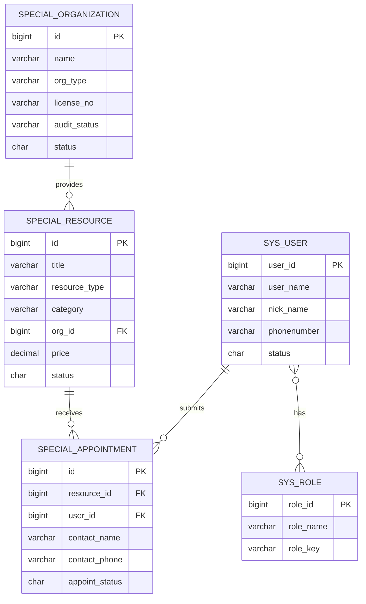

# 特殊教育平台 - 数据库 ER 设计

## 实体关系图

## 核心表说明

### special_resource（特教资源）

| 字段 | 类型 | 说明 |
|------|------|------|
| id | bigint | 主键 |
| title | varchar(200) | 资源标题 |
| resource_type | varchar(32) | course/tool/teacher/org/assessment |
| category | varchar(64) | 感统/语言/社交/行为干预等 |
| summary | varchar(500) | 摘要 |
| content | text | 详情 |
| org_id | bigint | 所属机构 |
| status | char(1) | 0草稿 1已发布 2已下架 |

### special_organization（机构/学校）

| 字段 | 类型 | 说明 |
|------|------|------|
| id | bigint | 主键 |
| name | varchar(200) | 名称 |
| org_type | varchar(32) | org/school |
| audit_status | char(1) | 0待审 1通过 2拒绝 |

### special_appointment（预约咨询）

| 字段 | 类型 | 说明 |
|------|------|------|
| id | bigint | 主键 |
| resource_id | bigint | 关联资源 |
| user_id | bigint | 申请人（可空） |
| contact_name | varchar(50) | 联系人 |
| contact_phone | varchar(20) | 电话 |
| appoint_status | char(1) | 0待处理 1已联系 2已完成 3已取消 |

## RBAC 四类角色

| 角色 | role_key | 说明 |
|------|----------|------|
| 家长 | special_parent | 浏览资源、提交预约 |
| 特教老师 | special_teacher | 发布/管理个人资源 |
| 机构管理员 | special_org_admin | 管理机构信息与资源 |
| 学校管理员 | special_school_admin | 管理学校对接与采购 |

## 初始化 SQL

执行顺序：

1. `server/script/sql/ry_vue.sql` — RuoYi 基础库
2. `server/script/sql/ry_special.sql` — 特教业务表 + 角色 + 菜单 + 示例数据

## API 端点

### 移动端（无需登录）

- `GET /special/mobile/resource/list` — 已发布资源列表
- `GET /special/mobile/resource/{id}` — 资源详情
- `GET /special/mobile/organization/list` — 已审核机构列表
- `POST /special/mobile/appointment` — 提交预约

### 管理端（需 RBAC 权限）

- `/special/resource/**` — 资源 CRUD
- `/special/organization/**` — 机构 CRUD
- `/special/appointment/**` — 预约管理
